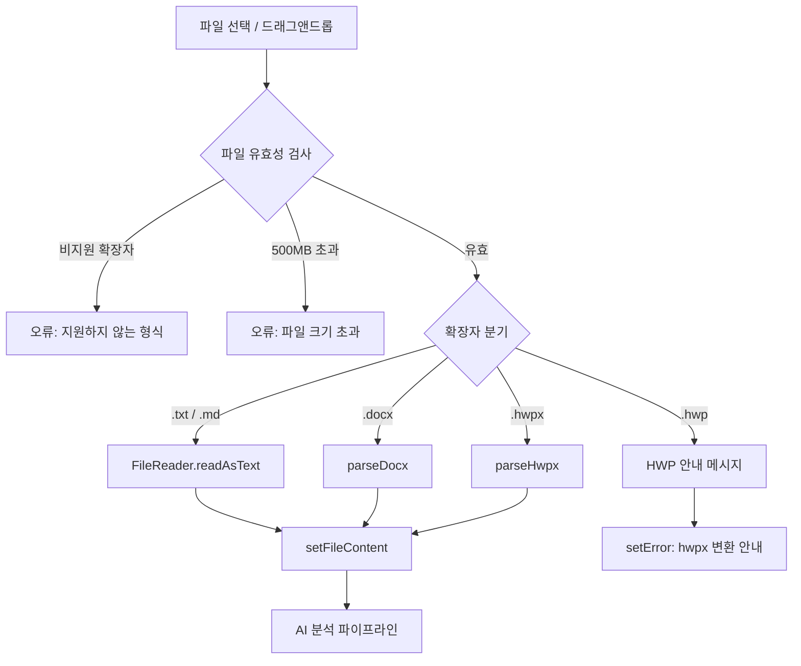
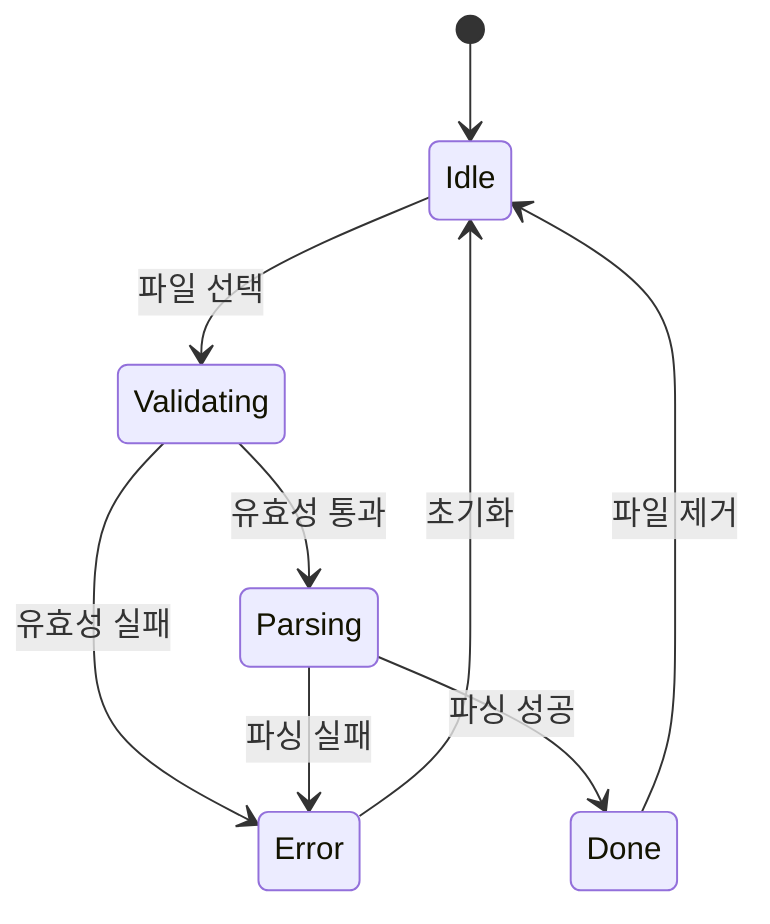

# Design Document: DOCX/HWP 파일 지원

## Overview

ReqFlow 앱(`kyag/src/App.tsx`)의 파일 업로드 기능을 확장하여 `.docx`, `.hwp`, `.hwpx` 형식을 지원한다.
현재는 `FileReader.readAsText()`로 텍스트 파일만 읽을 수 있으나, 이 설계는 브라우저 내장 API만으로 ZIP 기반 문서 포맷을 파싱하는 로직을 `App.tsx` 단일 파일 내에 추가한다.

외부 라이브러리(mammoth.js 등) 설치 없이 다음 브라우저 API를 활용한다:
- **ZIP 파싱**: ZIP 바이너리 포맷 직접 파싱 (End of Central Directory 탐색 방식)
- **XML 파싱**: `DOMParser` API
- **텍스트 파일**: 기존 `FileReader.readAsText()` 유지

---

## Architecture

### 변경 범위

`App.tsx` 단일 파일만 수정한다. 새 파일 생성 및 의존성 추가는 없다.

### 처리 흐름



### 파싱 중 상태 흐름



---

## Components and Interfaces

### 추가되는 순수 함수들

모두 `App.tsx` 내 컴포넌트 외부(모듈 스코프)에 정의한다.

#### `validateFile(file: File): { valid: true } | { valid: false; message: string }`

파일 확장자와 크기를 검사한다.

```typescript
const ALLOWED_EXTENSIONS = ['.txt', '.md', '.docx', '.hwp', '.hwpx'];
const MAX_FILE_SIZE = 500 * 1024 * 1024; // 500MB

function validateFile(file: File): { valid: true } | { valid: false; message: string }
```

#### `selectParser(extension: string): 'text' | 'docx' | 'hwpx' | 'hwp'`

확장자를 받아 사용할 파서 종류를 반환한다.

```typescript
function selectParser(extension: string): 'text' | 'docx' | 'hwpx' | 'hwp'
```

#### `parseZipFile(buffer: ArrayBuffer): Map<string, Uint8Array>`

ZIP 바이너리를 파싱하여 파일명 → 바이트 배열 맵을 반환한다.
End of Central Directory(EOCD) 레코드를 역방향 탐색하여 Central Directory를 찾고, 각 Local File Header를 읽어 파일 데이터를 추출한다.

```typescript
function parseZipFile(buffer: ArrayBuffer): Map<string, Uint8Array>
```

**ZIP 파싱 알고리즘:**
1. 버퍼 끝에서 역방향으로 EOCD 시그니처(`0x06054b50`) 탐색
2. EOCD에서 Central Directory 오프셋과 엔트리 수 읽기
3. 각 Central Directory 엔트리에서 파일명과 Local Header 오프셋 읽기
4. Local File Header(`0x04034b50`)에서 압축 방식, 크기, 데이터 오프셋 계산
5. 압축 방식 0(무압축) 또는 8(Deflate)에 따라 데이터 추출
6. Deflate 압축 데이터는 `DecompressionStream('deflate-raw')`로 해제

#### `parseDocx(buffer: ArrayBuffer): Promise<string>`

DOCX 파일(ZIP)에서 `word/document.xml`을 추출하고 `<w:t>` 태그의 텍스트를 수집한다.
`<w:p>` 단락 경계에서 줄바꿈(`\n`)을 삽입한다.

```typescript
async function parseDocx(buffer: ArrayBuffer): Promise<string>
```

**XML 파싱 전략:**
- `DOMParser().parseFromString(xmlString, 'text/xml')` 사용
- `<w:body>` 하위의 `<w:p>` 요소를 순회
- 각 `<w:p>` 내 `<w:t>` 요소의 `textContent`를 연결
- 단락 간 `\n` 삽입
- `<w:hdr>`, `<w:ftr>` 요소는 무시 (머리글/바닥글 제외)

#### `parseHwpx(buffer: ArrayBuffer): Promise<string>`

HWPX 파일(ZIP)에서 `Contents/section0.xml`(및 추가 섹션)을 추출하고 `<hp:t>` 태그의 텍스트를 수집한다.

```typescript
async function parseHwpx(buffer: ArrayBuffer): Promise<string>
```

**XML 파싱 전략:**
- `Contents/section0.xml`, `Contents/section1.xml` 등 섹션 파일 순차 처리
- `<hp:p>` 단락 요소 순회
- 각 `<hp:p>` 내 `<hp:t>` 요소의 `textContent` 연결
- 단락 간 `\n` 삽입

### `handleFileChange` 수정

기존 함수를 아래 로직으로 교체한다:

```typescript
const handleFileChange = async (e: React.ChangeEvent<HTMLInputElement>) => {
  const selectedFile = e.target.files?.[0];
  if (!selectedFile) return;

  // 1. 유효성 검사
  const validation = validateFile(selectedFile);
  if (!validation.valid) {
    setError(validation.message);
    if (fileInputRef.current) fileInputRef.current.value = "";
    return;
  }

  // 2. 파서 선택
  const ext = getExtension(selectedFile.name);
  const parserType = selectParser(ext);

  // 3. HWP 바이너리 안내
  if (parserType === 'hwp') {
    setError(`HWP(구버전) 파일은 브라우저에서 직접 파싱할 수 없습니다. 한글에서 '다른 이름으로 저장 → HWPX' 형식으로 변환 후 업로드해 주세요.`);
    if (fileInputRef.current) fileInputRef.current.value = "";
    return;
  }

  // 4. 파싱 (isAnalyzing 상태 재활용)
  setFile(selectedFile);
  setIsAnalyzing(true);
  setError(null);

  try {
    let text = "";
    if (parserType === 'text') {
      text = await readAsText(selectedFile);
    } else {
      const buffer = await selectedFile.arrayBuffer();
      if (parserType === 'docx') {
        text = await parseDocx(buffer);
      } else {
        text = await parseHwpx(buffer);
      }
    }
    setFileContent(text);
  } catch (err) {
    setError(`'${selectedFile.name}' 파싱 실패: ${err instanceof Error ? err.message : '알 수 없는 오류'}`);
    setFile(null);
    setFileContent("");
    if (fileInputRef.current) fileInputRef.current.value = "";
  } finally {
    setIsAnalyzing(false);
  }
};
```

### UI 변경 사항

- 파일 업로드 영역의 `accept` 속성: `.txt,.md,.docx,.hwp,.hwpx`
- 파싱 중 로딩: 기존 `isAnalyzing` 상태를 재활용하여 `Loader2` 아이콘 표시
- 파싱 완료: 기존 파일명 표시 UI 그대로 유지
- 오류: 기존 `error` 상태를 통해 표시

---

## Data Models

### 상태 변경 없음

기존 상태(`file`, `fileContent`, `error`, `isAnalyzing`)를 그대로 사용한다. 새 상태 추가 없음.

| 상태 | 타입 | 파싱 관련 역할 |
|------|------|---------------|
| `file` | `File \| null` | 선택된 파일 객체 (파일명 표시용) |
| `fileContent` | `string` | 파싱된 텍스트 (AI 분석 입력) |
| `error` | `string \| null` | 유효성/파싱 오류 메시지 |
| `isAnalyzing` | `boolean` | 파싱 중 로딩 표시 재활용 |

### ZIP 내부 구조

**DOCX (`word/document.xml` 핵심 구조):**
```xml
<w:document>
  <w:body>
    <w:p>                    <!-- 단락 → \n 삽입 -->
      <w:r>
        <w:t>텍스트</w:t>    <!-- 추출 대상 -->
      </w:r>
    </w:p>
  </w:body>
</w:document>
```

**HWPX (`Contents/section0.xml` 핵심 구조):**
```xml
<hh:section>
  <hp:p>                     <!-- 단락 → \n 삽입 -->
    <hp:run>
      <hp:t>텍스트</hp:t>    <!-- 추출 대상 -->
    </hp:run>
  </hp:p>
</hh:section>
```

### ZIP 바이너리 레이아웃

```
[Local File Header 1] [File Data 1]
[Local File Header 2] [File Data 2]
...
[Central Directory Entry 1]
[Central Directory Entry 2]
...
[End of Central Directory Record]
```

- Local File Header 시그니처: `0x04034b50`
- Central Directory 시그니처: `0x02014b50`
- EOCD 시그니처: `0x06054b50`

---

## Correctness Properties

*A property is a characteristic or behavior that should hold true across all valid executions of a system — essentially, a formal statement about what the system should do. Properties serve as the bridge between human-readable specifications and machine-verifiable correctness guarantees.*

### Property 1: 파일 확장자 검증 완전성

*For any* 파일명에 대해, `validateFile`이 유효하다고 판단하는 경우는 오직 허용된 확장자(`.txt`, `.md`, `.docx`, `.hwp`, `.hwpx`) 중 하나를 가질 때뿐이며, 그 외 모든 확장자는 오류 메시지를 반환한다.

**Validates: Requirements 1.1, 1.2**

### Property 2: 파일 크기 차단 일관성

*For any* 파일 크기 값에 대해, 500MB(524,288,000 바이트)를 초과하는 경우 `validateFile`은 항상 오류를 반환하고, 이하인 경우 크기 이유로는 오류를 반환하지 않는다.

**Validates: Requirements 1.3, 7.1**

### Property 3: 파서 선택 결정론성

*For any* 지원 확장자에 대해, `selectParser`는 항상 동일한 파서 타입을 반환한다 — `.txt`/`.md`는 `'text'`, `.docx`는 `'docx'`, `.hwpx`는 `'hwpx'`, `.hwp`는 `'hwp'`.

**Validates: Requirements 4.1, 4.2, 4.3, 4.4**

### Property 4: DOCX 텍스트 보존

*For any* 텍스트 내용을 담은 유효한 DOCX 바이너리에 대해, `parseDocx`가 반환하는 문자열은 원본 `<w:t>` 요소들의 텍스트를 모두 포함한다.

**Validates: Requirements 2.1**

### Property 5: DOCX 단락 구분 보존

*For any* N개(N ≥ 2)의 단락을 가진 유효한 DOCX 바이너리에 대해, `parseDocx`가 반환하는 문자열에는 최소 (N-1)개의 줄바꿈 문자(`\n`)가 포함된다.

**Validates: Requirements 2.2**

### Property 6: HWPX 텍스트 보존

*For any* 텍스트 내용을 담은 유효한 HWPX 바이너리에 대해, `parseHwpx`가 반환하는 문자열은 원본 `<hp:t>` 요소들의 텍스트를 모두 포함한다.

**Validates: Requirements 3.1**

### Property 7: 손상된 파일 오류 처리

*For any* 유효하지 않은 바이너리 데이터(ZIP 시그니처 없음, 잘못된 XML 등)에 대해, `parseDocx`와 `parseHwpx`는 텍스트를 반환하지 않고 반드시 오류를 throw한다.

**Validates: Requirements 2.3, 3.3**

### Property 8: 파싱 오류 메시지 형식

*For any* 파일명과 오류 원인에 대해, 파싱 실패 시 설정되는 `error` 상태 문자열은 파일명과 오류 원인을 모두 포함한다.

**Validates: Requirements 6.1**

---

## Error Handling

### 오류 유형 및 처리 방식

| 오류 상황 | 처리 방식 | 상태 변화 |
|-----------|-----------|-----------|
| 비지원 확장자 | `setError(메시지)`, 파일 입력 초기화 | `file: null`, `error: 메시지` |
| 500MB 초과 | `setError(메시지)`, 파일 입력 초기화 | `file: null`, `error: 메시지` |
| HWP 바이너리 | `setError(hwpx 변환 안내)`, 파일 입력 초기화 | `file: null`, `error: 안내 메시지` |
| ZIP 파싱 실패 | `catch`에서 `setError(파일명 + 원인)`, 상태 초기화 | `file: null`, `fileContent: ""`, `error: 메시지` |
| XML 파싱 실패 | 동일 | 동일 |
| 빈 텍스트 추출 | 빈 문자열로 정상 처리 (오류 아님) | `fileContent: ""` |

### 오류 메시지 형식

```
'${fileName}' 파싱 실패: ${원인}
```

예시:
- `'보고서.docx' 파싱 실패: ZIP 파일 형식이 올바르지 않습니다`
- `'문서.hwpx' 파싱 실패: section0.xml을 찾을 수 없습니다`
- `파일 크기가 500MB를 초과합니다 (현재: 512MB)`
- `지원하지 않는 파일 형식입니다: .pdf (지원 형식: .txt, .md, .docx, .hwp, .hwpx)`

### HWP 바이너리 안내 메시지

```
HWP(구버전) 파일은 브라우저에서 직접 파싱할 수 없습니다.
한글에서 '다른 이름으로 저장 → HWPX' 형식으로 변환 후 업로드해 주세요.
```

---

## Testing Strategy

### 단위 테스트 (예시 기반)

**`validateFile` 테스트:**
- 각 허용 확장자(`.txt`, `.md`, `.docx`, `.hwp`, `.hwpx`)에 대해 `valid: true` 반환 확인
- `.pdf`, `.xlsx`, `.pptx` 등 비지원 확장자에 대해 오류 메시지 반환 확인
- 정확히 500MB 파일: 허용
- 500MB + 1바이트 파일: 차단

**`selectParser` 테스트:**
- 각 확장자별 올바른 파서 타입 반환 확인
- 대소문자 처리: `.DOCX`, `.Docx` → `'docx'`

**`parseZipFile` 테스트:**
- 알려진 ZIP 바이너리에서 파일 목록 정확히 추출
- 잘못된 시그니처 데이터에서 오류 throw 확인

**`parseDocx` 테스트:**
- 단일 단락 DOCX: 텍스트 추출 확인
- 다중 단락 DOCX: 줄바꿈 포함 확인
- 손상된 바이너리: 오류 throw 확인

**`parseHwpx` 테스트:**
- 단일 섹션 HWPX: 텍스트 추출 확인
- 다중 섹션 HWPX: 모든 섹션 텍스트 포함 확인
- 손상된 바이너리: 오류 throw 확인

### 속성 기반 테스트 (Property-Based)

프로젝트에 테스트 프레임워크가 없으므로, 속성 기반 테스트는 향후 `vitest` + `fast-check` 도입 시 구현한다.
각 속성은 위 Correctness Properties 섹션에 정의된 대로 구현한다.

**Property 1 구현 예시 (fast-check):**
```typescript
// Feature: docx-hwp-file-support, Property 1: 파일 확장자 검증 완전성
fc.assert(fc.property(
  fc.string().filter(s => !ALLOWED_EXTENSIONS.some(ext => s.toLowerCase().endsWith(ext))),
  (filename) => {
    const mockFile = new File([], filename);
    const result = validateFile(mockFile);
    return result.valid === false && result.message.length > 0;
  }
), { numRuns: 100 });
```

**Property 7 구현 예시 (fast-check):**
```typescript
// Feature: docx-hwp-file-support, Property 7: 손상된 파일 오류 처리
fc.assert(fc.property(
  fc.uint8Array({ minLength: 1, maxLength: 1000 }).filter(
    arr => !isValidZipSignature(arr)
  ),
  async (bytes) => {
    const buffer = bytes.buffer;
    await expect(parseDocx(buffer)).rejects.toThrow();
    await expect(parseHwpx(buffer)).rejects.toThrow();
  }
), { numRuns: 100 });
```

### 통합 테스트

- 실제 `.docx` 파일 업로드 → `fileContent` 상태에 텍스트 설정 확인
- 실제 `.hwpx` 파일 업로드 → `fileContent` 상태에 텍스트 설정 확인
- 파싱된 텍스트로 AI 분석 파이프라인 정상 동작 확인
- 기존 `.txt`/`.md` 파일 업로드 동작 유지 확인
